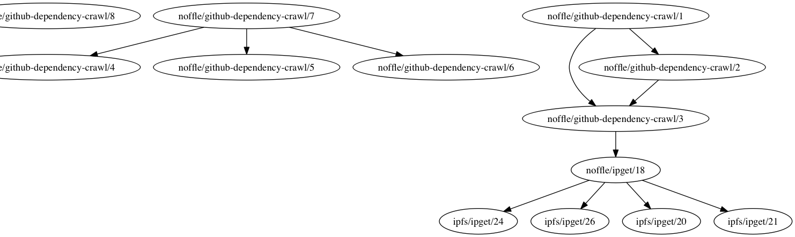

# issue-dep-dot

This is a module to graph issue dependencies with graphviz's dot. This just takes care of visualizing the data with dot, and expects all data to be fed into it. It is meant to work with https://github.com/noffle/github-dependency-crawl

## TODO

This module is in a super basic state. It just gets the basic transformation there.

- [x] basic digraph dot output
- [ ] make it work on a single issue
- [ ] make it streaming (would be nice for large graphs)
- [ ] test output on the browser with emscripten graphviz
- [ ] use deps + closed status to color the graph (automated ready / blocked)
- [ ] show other info
  - [ ] gather + show status (open/closed) (as color, maybe?)
  - [ ] gather + show labels
  - [ ] gather + show assignee
  - [ ] gather + show (progress pipeline label {backlog, ready, blocked, done})

## Example


```
> issue-dep-dot https://github.com/noffle/github-dependency-crawl
digraph deps {
    noffle_github_dependency_crawl_12 [label="noffle/github-dependency-crawl/12"];
    noffle_github_dependency_crawl_11 [label="noffle/github-dependency-crawl/11"];
    noffle_github_dependency_crawl_10 [label="noffle/github-dependency-crawl/10"];
    noffle_github_dependency_crawl_9 [label="noffle/github-dependency-crawl/9"];
    noffle_github_dependency_crawl_8 [label="noffle/github-dependency-crawl/8"];
    noffle_github_dependency_crawl_7 [label="noffle/github-dependency-crawl/7"];
    noffle_github_dependency_crawl_4 [label="noffle/github-dependency-crawl/4"];
    noffle_github_dependency_crawl_5 [label="noffle/github-dependency-crawl/5"];
    noffle_github_dependency_crawl_6 [label="noffle/github-dependency-crawl/6"];
    noffle_github_dependency_crawl_3 [label="noffle/github-dependency-crawl/3"];
    noffle_ipget_18 [label="noffle/ipget/18"];
    noffle_github_dependency_crawl_2 [label="noffle/github-dependency-crawl/2"];
    noffle_github_dependency_crawl_1 [label="noffle/github-dependency-crawl/1"];
    ipfs_ipget_24 [label="ipfs/ipget/24"];
    ipfs_ipget_26 [label="ipfs/ipget/26"];
    ipfs_ipget_20 [label="ipfs/ipget/20"];
    ipfs_ipget_21 [label="ipfs/ipget/21"];

    noffle_github_dependency_crawl_7 -> noffle_github_dependency_crawl_4;
    noffle_github_dependency_crawl_7 -> noffle_github_dependency_crawl_5;
    noffle_github_dependency_crawl_7 -> noffle_github_dependency_crawl_6;
    noffle_github_dependency_crawl_3 -> noffle_ipget_18;
    noffle_github_dependency_crawl_2 -> noffle_github_dependency_crawl_3;
    noffle_github_dependency_crawl_1 -> noffle_github_dependency_crawl_2;
    noffle_github_dependency_crawl_1 -> noffle_github_dependency_crawl_3;
    noffle_ipget_18 -> ipfs_ipget_24;
    noffle_ipget_18 -> ipfs_ipget_26;
    noffle_ipget_18 -> ipfs_ipget_20;
    noffle_ipget_18 -> ipfs_ipget_21;
}
```

### View that with dot

```
# save the dot output
> issue-dep-dot https://github.com/noffle/github-dependency-crawl >deps.dot

# make an svg, and view it in your browser
> cat deps.dot | dot -Tsvg >deps.svg

# or make a png, and view it in your browser
> cat deps.dot | dot -Tpng >deps.png
```



This example is clipped because it's very wide.
